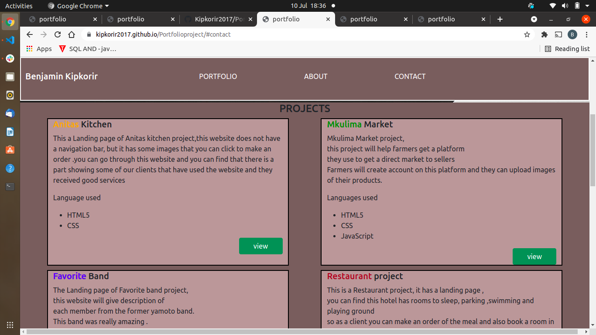
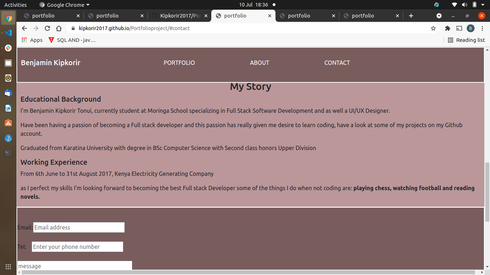
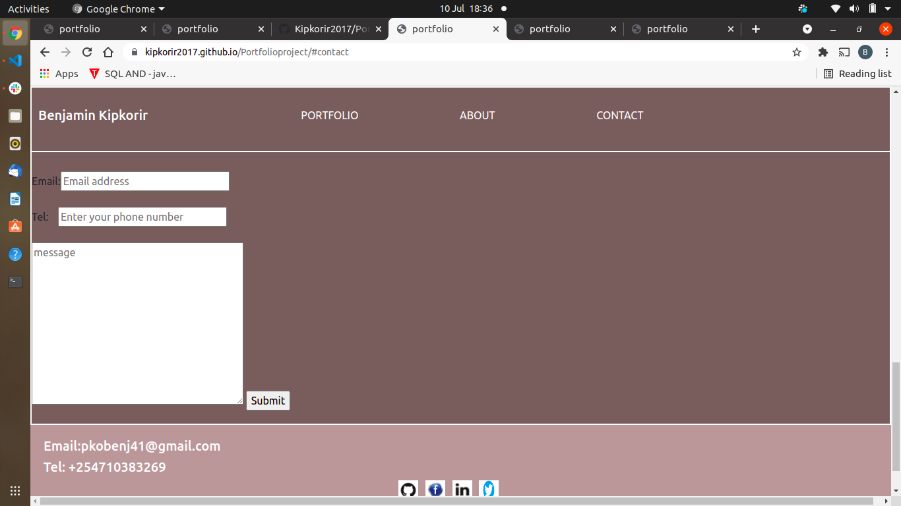

# Landing page of my portfolio
This is a landing page of my portfolio project , it has active links to show you some of the projects that have done so far.
## Author
By Benjamin Kipkorir Tonui
# Description
This project has a navigation bar with 4 items that is my name,portfolio which is home, about and contact section, in tha about section you can get to see my story that is education background, work experience, etc.
contact section will give you a  way so that you can reach me, entering your email, phone number, and a message.
# active link 
[a link] (https://kipkorir2017.github.io/Portfolioproject/)
## screenshots of our website
home page

&nbsp;

welcome to my portfolio,navigate on my website
<image src="assets/images/navigationbar.png" alt="navigation">

&nbsp;

projects

&nbsp;

Have a look at some of my projects

&nbsp;

about section

&nbsp;

know more about me

&nbsp;

contact section and footer

&nbsp;

Get to contact section and leave a message

## Setup/Installation Requirements
git 
browser
internet
a pc
text Editor
## known bugs
There are known bugs at the moment
## Technologies used
* HTML
* CSS
* Bootstrap
* Javascript
## contact details
you can reach to me through these contact details: Email:pkobenj41@gmail.com, Tel:+254710383269
## Licence
MIT licence (2021) By Benjamin Kipkorir

